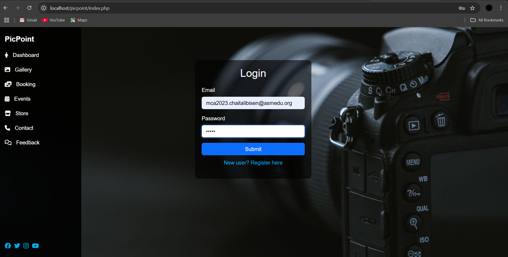
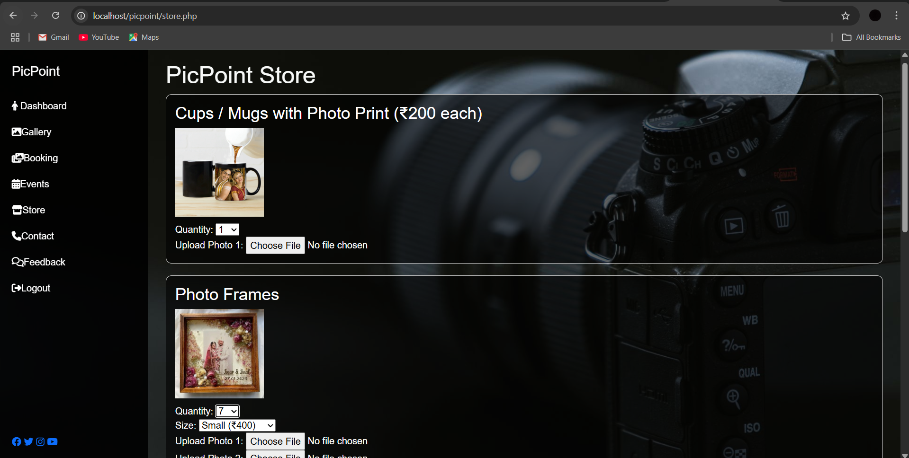
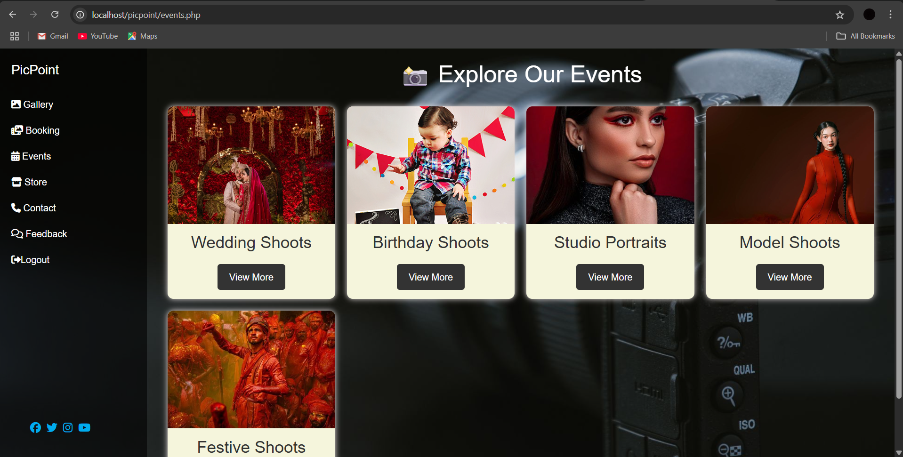
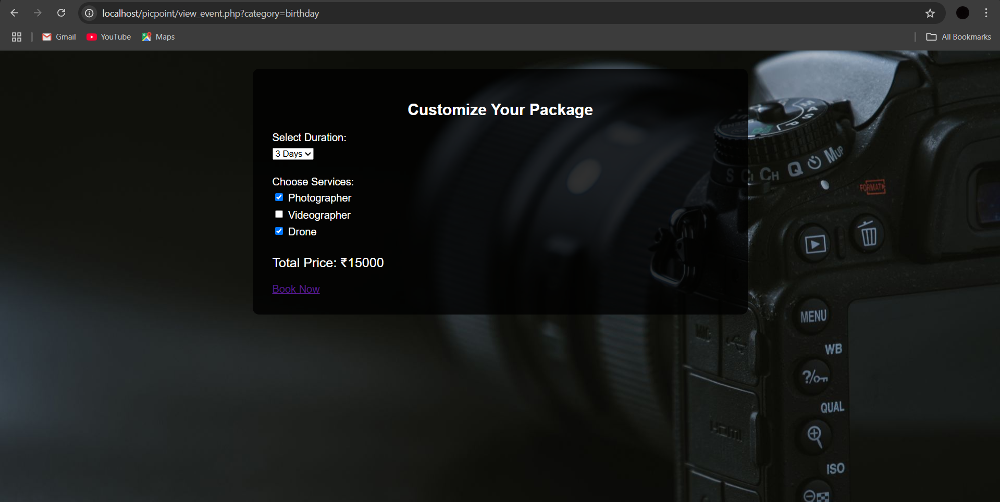
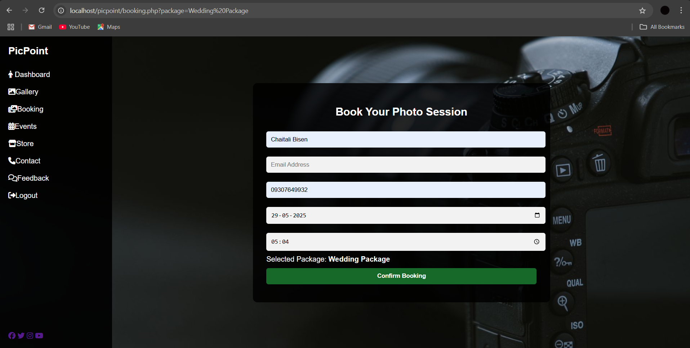

# 📸 PicPoint – Photo Studio Management System
PicPoint is a web-based photo studio management system built with PHP &amp; MySQL. It handles bookings, photo uploads, store orders, dynamic pricing, QR-based payments, admin operations, and user feedback streamlining every aspect of studio workflows.

---

## 🚀 Features

✨ **User Modules**
- Secure registration and login system
- Book photography packages with date and time
- Upload images for customized product orders (like mugs, frames, t-shirts)
- Check BMI and explore home remedies
- Give feedback and contact support

🛒 **E-Commerce**
- Shop products like photo mugs, t-shirts, polaroids, and frames
- Upload images per product quantity
- Select t-shirt and frame sizes dynamically
- Auto-price calculation and redirection to payment

🧑‍💼 **Admin Panel**
- Manage users, packages, products, and orders
- View and respond to feedback
- Handle contact form queries
- View booking and sales reports

📊 **Utilities**
- Dynamic package loading
- Responsive dashboard with side menu layout
- Fully integrated MySQL database
- Secure form validations and alerts

---

## 🛠️ Technologies Used

- **Frontend:** HTML5, CSS3, JavaScript
- **Backend:** PHP (Core)
- **Database:** MySQL
- **Development Platform:** XAMPP (Apache, MySQL)
- **Other Tools:** Bootstrap, jQuery

---

## 📂 Project Structure
picpoint/
├── admin/
├── user/
├── store/
├── css/
├── js/
├── includes/
├── images/
├── database/
├── feedback.php
├── booking.php
├── contact.php
├── login.php
├── register.php
└── ...

## 🖼️ Screenshots

A glimpse of the PicPoint Photo Studio Management Web Application UI:

---

### 🔐 Login Page  

---

### 🛍️ Store Page  

---

### 🎉 Events Page  

---

### 📦 Packages Page  

---

### 🖼️ Gallery Page  

---

### 📅 Booking Page  

